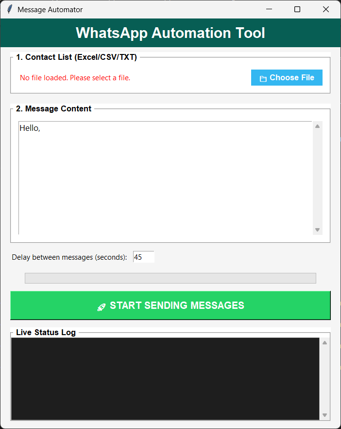

# Message Automation

Automates sending messages using the script `Message automation.py`.

**Preview:**



**Files:**
- `Message automation.py` — main script that automates messaging.
- `interface.png` — screenshot of the interface used in this project.

## Requirements
- Python 3.8+
- Any additional Python packages used by `Message automation.py` (see the top of the script for imports).

## Usage
1. Open a terminal in this folder.
2. (Optional) Create and activate a virtual environment:

```powershell
python -m venv venv
.\venv\Scripts\Activate.ps1
```

3. Install any dependencies (if needed):

```powershell
pip install -r requirements.txt
```

4. Run the script:

```powershell
python "Message automation.py"
```
